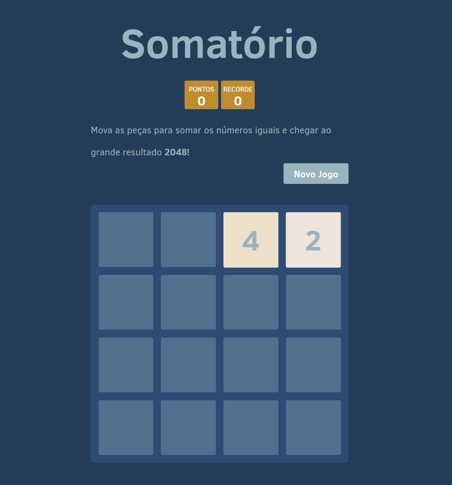
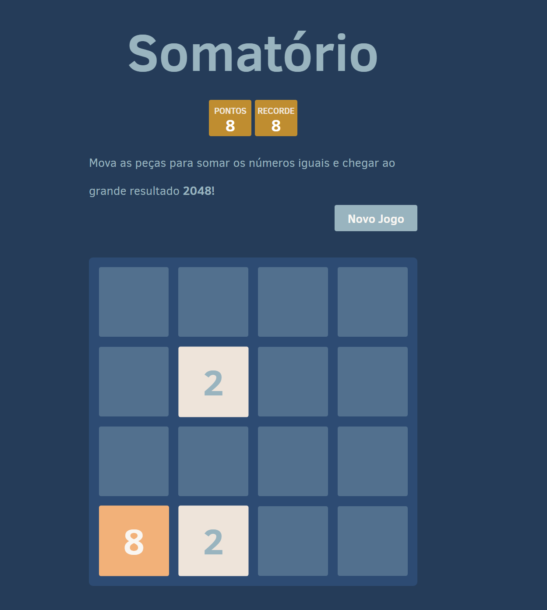

## Seja Bem-Vindo!

# Somatório

Este repositório contém toda a documentação do Somatório, desenvolvido como projeto final da disciplina de Computabilidade e Complexidade de Algoritmos.

## Equipe de desenvolvimento:
- Johnatan Caetano dos Santos - 30087155 - [GitHub](https://github.com/Johnatan-Caetano)

## Links

🔗[Checklist para o Projeto de Algoritmo](https://docs.google.com/document/d/1CatBMVIVNqbNBmmgbAoUlQGqpjbc98ElBZfwimG97nM/edit?usp=sharing)

🔗[Link do Jogo - Scratch](https://scratch.mit.edu/projects/1099604391)

🔗[Video do jogo - Youtube](https://youtu.be/QSmho8mQw30)

## Qual o objetivo do jogo?
O objetivo desse jogo de raciocínio é juntar os blocos numerados na tela até alcançar 2048. Apesar desse objetivo simples, sempre que fizer um movimento que junta dois blocos do mesmo valor, outro bloco do número par seguinte surgirá na tela. E assim por diante. Se simplesmente juntar blocos aleatoriamente, acabará com a tela cheia de blocos e um aviso de derrota. 

## Dicas sobre o jogo
Dicas para jogar 2048
Ao iniciar o jogo, mova os blocos apenas na direção horizontal ou vertical. Mova apenas em outra direção quando terminarem as jogadas possíveis;

Tente usar os cantos. Assim, terá mais superfície da tela para fazer suas jogadas;

Mantenha blocos com valores altos perto uns dos outros. Dessa forma eles serão mais fáceis de juntar;

Resista à tentação de juntar blocos muito grandes no começo da partida. Pode tornar impossível adicionar blocos que combinem com esses blocos grandes. 

Pense antes de mover. Esse é um jogo de raciocínio, não de rapidez a mover peças. Mover um bloco de 2 ou 4 para o lugar certo poderá resultar em várias jogadas mais vantajosas que um bloco grande.

## Tecnologias Utilizadas no Desenvolvimento
- HTML
- CSS
- JavaScript

## Estrutura e Arquitetura do Jogo Somatório

### Estrutura dos Dados

- **Tabuleiro (Board)**:
  - O jogo utiliza uma matriz 4x4, onde cada célula pode conter um número (2, 4, 8, etc.) ou estar vazia (0).
  - Cada célula representa uma peça do jogo e pode ser combinada com outras peças do mesmo valor para dobrar seu valor.
  - O estado do tabuleiro é atualizado conforme o jogador realiza movimentos e combina peças.

- **Peças (Tiles)**:
  - Cada peça tem um valor numérico que pode dobrar ao combinar com outra peça do mesmo valor.
  - Os valores das peças são 2, 4, 8, 16, 32, 64, 128, 256, 512, 1024 e 2048.

- **Estado do Jogo (Game State)**:
  - **Pontuação**: A pontuação é calculada ao combinar peças. Cada vez que duas peças se combinam, o valor resultante é adicionado à pontuação.
  - **Status**: O estado do jogo pode ser "em andamento", "vencido" ou "perdido".
  - **Movimentos**: A lógica do jogo registra os movimentos do jogador.

### Arquitetura

- **Frontend**:
  - **HTML**: Define a estrutura do jogo, incluindo o tabuleiro e a interface.
  - **CSS**: Estiliza o jogo, incluindo grid e animações.
  - **JavaScript**: Implementa a lógica do jogo. Ele manipula a movimentação das peças, as combinações de peças e mantém o estado do jogo.
  
- **Lógica de Jogo**:
  - **Controle do Tabuleiro**: A lógica manipula as posições das peças na matriz 4x4 e garante que as peças se movam corretamente e se combinem de acordo com as regras do jogo.
  - **Detecção de Combinações**: A lógica detecta se duas peças podem ser combinadas ao realizar o movimento e combina-las caso sejam do mesmo valor.
  - **Verificação de Movimento**: Após cada movimento, verifica se ainda existem movimentos válidos restantes no tabuleiro.
  - **Pontuação**: A lógica aumenta a pontuação do jogador sempre que duas peças se fundem.

- **Fluxo de Jogo**:
  - **Início**: O jogo começa com duas peças no tabuleiro e com um estado inicial vazio.
  - **Movimentos**: O jogador pressiona uma tecla de seta para mover as peças no tabuleiro.
  - **Combinação de Peças**: Ao detectar duas peças adjacentes com o mesmo valor, elas são fundidas em uma única peça com valor dobrado.
  - **Fim de Jogo**: O jogo termina quando o jogador cria uma peça com o valor 2048 ou quando não há mais movimentos possíveis.
  
## Consumo de Memória

O consumo de memória do jogo é otimizado devido à sua estrutura simples. O jogo utiliza uma matriz 4x4 para armazenar os valores das peças, resultando em apenas 16 células que ocupam uma quantidade mínima de memória. O estado de cada peça é controlado por seu valor numérico. A pontuação e o status do jogo são armazenados em variáveis simples, o que também contribui para um baixo uso de memória.

## Armazenamento Local

O jogo pode usar **localStorage** para armazenar o progresso do jogador, incluindo o estado do tabuleiro e a pontuação. Esse armazenamento é eficiente e permite que o jogador retome o jogo após fechar o navegador. O espaço utilizado é mínimo, normalmente inferior a alguns kilobytes, o que está bem abaixo do limite de armazenamento de 5 MB do **localStorage**.

## Desempenho da Máquina

O jogo é leve e otimizado para rodar de maneira eficiente na maioria das máquinas e dispositivos:

### CPU e Memória
- O jogo utiliza recursos mínimos de CPU e memória, uma vez que a lógica é baseada em manipulações simples de uma matriz 4x4. Isso permite que o jogo rode sem problemas em dispositivos de baixo desempenho, como smartphones mais antigos.

### Desempenho em Diferentes Dispositivos
- O jogo é responsivo e funciona bem em dispositivos móveis e desktops. Em dispositivos modernos, a renderização das animações é fluida, enquanto em dispositivos mais antigos o desempenho ainda é adequado devido à simplicidade do jogo.

### Navegadores
- Navegadores modernos (como Chrome, Firefox, Safari e Edge) executam o jogo com alta eficiência. Mesmo em navegadores mais antigos, o desempenho não é significativamente afetado devido à simplicidade das operações.

### Animações
- As animações são feitas com transições CSS simples, que são leves e não consomem muitos recursos, garantindo um desempenho suave.

## Conclusão

O jogo Somatório tem um consumo de memória e desempenho muito eficiente, permitindo que seja jogado sem problemas em uma ampla gama de dispositivos, desde smartphones mais simples até computadores de alta performance. O uso de armazenamento local oferece uma boa experiência de continuidade, sem impactar negativamente o desempenho do jogo.

## Inspiração Para o Projeto
O jogo foi inspirado no famoso jogo 2048 disponibilizando tanto para Android quanto para IOS e também na versão Web.
- [2048](https://2048game.com/?utm_source=bing-search&msclkid=2928b205da3911d883f4d53b4ccab283) - Desenvolvedora: Gabriele Cirulli - 2014

## Problema a Ser Resolvido:
O desafio que queremos abordar é: "Como criar um jogo que estimule o raciocínio lógico e estratégico ao combinar números até alcançar um objetivo específico?"

Para isso, utilizamos como base um modelo matemático simples, porém desafiador, onde cada movimento exige planejamento e atenção. O jogador deve combinar números iguais para formar novos valores, sempre buscando alcançar a soma máxima: 2048.

Esse problema não só desafia habilidades matemáticas, mas também a tomada de decisões rápidas, oferecendo uma experiência interativa e educativa que entretém e estimula a mente.

## Regras (Jogabilidade)

- O jogador começa o jogo com uma grade de números iniciais.
- A cada movimento, todos os blocos na direção escolhida se combinam se tiverem o mesmo valor.
- Um novo número aparece na grade após cada movimento.
- O objetivo é combinar os números até formar o 2048.
- O jogo termina quando não houver mais movimentos possíveis, ou quando conseguir formar um bloco com o valor 2048.

### Guia do Jogo: Somatório;

1. **Início do Jogo**  
   - O jogador inicia com a pontuação zerada e com 2 blocos rederizados para começar os movimentos.  

     

      

2. **Controles do jogo**  
   - As setas do teclado servirão para guiar os blocos.  

3. **Aquisição de pontos**  
   - A cada bloco de números iguais ao ser juntado trará um resultado da soma dos dois e a cada soma o resultado será armazenado na pontuação.  

     

4. **Vitória**  
   - Será vencedor o jogador que conseguir chegar no bloco de valor 2048.  

5. **Fim de jogo**  
   - O jogador perderá ao encher a grid de blocos e não houver mais movimentos possíveis de soma.  

## Conclusão

A criação do jogo Somatório foi um percurso desafiador e recompensador, unindo lógica, matemática e design de interface para proporcionar uma experiência de jogo cativante. O objetivo principal, somar quadrados até alcançar o número 2048, não só oferece um desafio intelectual, mas também proporciona um sentimento de vitória ao alcançar objetivos progressivos.

Ao longo do desenvolvimento, utilizamos princípios de programação, tais como manipulação de estados, gerenciamento de eventos e aprimoramento de desempenho, assegurando que a jogabilidade fosse suave e compreensível. A interface foi meticulosamente elaborada para ser intuitiva e simples, possibilitando que os jogadores se concentrem no desafio do jogo sem interrupções.

O jogo tem um consumo de memória e desempenho muito eficiente, permitindo que seja jogado sem problemas em uma ampla gama de dispositivos, desde smartphones mais simples até computadores de alta performance. O uso de armazenamento local oferece uma boa experiência de continuidade, sem impactar negativamente o desempenho do jogo.

## Referências para a pesquisa:
- [JOGO 2048](https://www.2048.org/)
- [Progressão Aritmética](https://pt.scribd.com/document/534039196/Progressao-Aritmetica-P-a-Toda-Materia) - Prof. Rafael Asth
